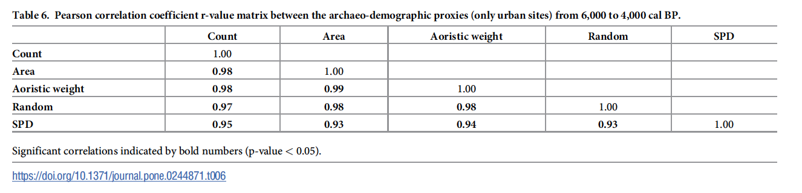

```{r setup, include=FALSE}
knitr::opts_chunk$set(
	echo = TRUE,
	warning = TRUE,
	message = TRUE,
	comment = "##",
	prompt = FALSE,
	tidy = TRUE,
	tidy.opts = list(blank = FALSE, width.cutoff = 60),
	fig.path = "img/",
	fig.align = "center"
)
```

### Paper outline


The paper is an addition to the growing body of research focused on the relationship between ancient societies and rapid climatic events, specifically the 4.2 kya event (a period of increased aridity and cooling). Lawrence et al. (2021) aim to take an empirical approach at a large spatial scale to investigate trends in population and settlement organization related to the impact of the 4.2 kya event across the entirety of the Northern Fertile Crescent from 6,000 to 3,000 cal. BP. 

The paper employs three different datasets (archaeological data and radiocarbon dates) from the period between 6000 and 3000 cal. BP to investigate population trends.  There are two different archaeological settlement datasets used in this study. The first consists of data collected from 16 published archaeological surveys and includes 1157 sites divided into 2783 occupation phases. The second consists of urban settlement data (defined as sites which reach a size of ten hectors or more) and includes 132 urban sites divided into 283 occupation phases. The third dataset is comprised of 963 radiocarbon dates from archaeological contexts collected over a slightly broader time range, 6500 to 2500 uncal. BP, in the aim to avoid edge effects.  

The archaeological settlement data (both sets) were binned into a series of 100-year time slices starting at 6,000 BP and ending at 3,000 BP. The authors applied aoristic approaches to deal with uncertainties in the dataset. Essentially, this method assumes that the total probability of an archaeological event within a given time span is 1, which indicates absolute certainty. This is then divided by the length of the sites chronological range to represent the probability of existence for each temporal block (100 years) and an aoristic weight is produced (displayed in Fig. 4 and 5). In addition, Monte Carlo methods were applied to generate randomised start of occupation periods that could be compared with other demographic proxies. 

The radiocarbon dataset was processed using the R package rcarbon. The dates were calibrated and a summed probability distribution (SPD) of individual dates was produced. A KDE map of the spatial distributions of radiocarbon dates was created. they compared the summed normalised probability distributions and observed unnormalized SPDs of calibrated radiocarbon dates against a theoretical null model. They fitted a logistic growth model to the observed SPD and produced a 95% confidence envelope of 1,000 SPDs to test if the observed pattern differed from the null models (displayed in Fig. 2).  

The conclusions of this study indicate support for claims of a decline in population and social complexity in relation to the 4.2 kya event. There are obvious negative trends in all three datasets between 4,300 and 3,900 cal. BP and sharp drops in the SPD and rural settlement proxies. 


### Specific data and analysis that will be replicated


This report will replicate almost all parts of the analyses conducted in the original paper on all three assemblages. However, it will re-frame from replicating the spatial data maps. 


The archaeological datasets: 

Both archaeological datasets were analysed using the same methodology. The settlement data was loaded in and the dates associated with sites were converted from BC/AD to BP for analysis and site duration was also calculated and added to the dataset. The paper split the data into two groups, above or below 300mm annual average rainfall, and so this was replicated in the analyses. Bins of 100 year time slices were created.  Aoristic weights of all sites were calculated and placed into a new data frame, this was replicated with sites above 300mm or below 300mm of rainfall. The data was sumarised in order for it to be plotted, this included extracting the site counts and aoristic weights for both rainfall groups and extracting the dates of value (between 3000 - 6000 BP) and converting them into vectors that could be plotted. - Fig 4 and 5 were reproduced. 


The radiocarbon dataset:

The radiocarbon data will be processed using the 'rcarbon' R package outline in the paper (and above). The goal of this will be to replicate the calibration and summed probability distributions (SPD) in order to reproduce Figure 2b, c, and d. The dataset will be divided into two groups. The first will be all dates and the second will be the dates produced from short-lived organic samples (e.g. bones, collagen, seeds, etc). These groups will be calibrated using the 'calibrate()' function and, as discussed in the paper, they will be un-normalized to avoid artificial peaks produced by normalization. SPDs of all individual dates within a time range of 6,500 to 2,500 BP are produced next. Bins of 50 years were created in order to reduced potential biases associated with SPDs. Distributions of both groups (all dates and short-lived) were produced, as well as normalized and un-normalized SPDs for comparison. Additionally, Pearsons coefficients were also calculated and correlated to 0.96 as per the paper. 


### Archaeological Settlement data 


```{r}
sites <- read.csv("settlements.csv", sep = ",", header = T) #load in site data
head(sites) #check first lines 

nrow(sites) #2783 occupation phases (corresponds with paper)

#dates are in BC/AD and need to be converted to BP for analysis
StartdatesBP <- (sites$StartDate) + 1950 #create new variable
EnddatesBP <- (sites$EndDate) + 1950

sites[, "StartdatesBP"] <- StartdatesBP #add variables to df 
sites[, "EnddatesBP"] <- EnddatesBP

#duration of sites
Duration <- sites$StartdatesBP - sites$EnddatesBP
sites[, "Duration"] <- Duration #add to df
head(sites)

#the paper splits the date into two groups, above or below 300mm rainfall avg. 
above300mm <- subset(sites, sites$Rain_mm > 300) #variable will be used later
below300mm <- subset(sites, sites$Rain_mm <= 300)


#basic descriptive stats of the rainfall groups 
summary(above300mm$Rain_mm) #rainfall stats
summary(below300mm$Rain_mm)
  
summary(above300mm$Duration) #duration of site occupation in both groups
summary(below300mm$Duration)

```

The settlement data is binned into a series of 100-year time slices and a new column is created to put the binned results in. 

```{r}
binwidth <- 100
breaks <- seq(1900, 8800, by = binwidth) #include range of dates
mids <- seq(min(breaks) + (binwidth/2), max(breaks) - (binwidth/2), by=binwidth)
newcolumns <- paste(breaks[1:(length(breaks)-1)], "start", sep = "")
```

An aoristic method is applied to the dataset. First a new dataframe needs to be created for the results, this includes a new column for site counts and one for the aoristic weights. Then a loop is used to create aoristic weights. This process assumes that the probability of site occupation occurring at each site is 1, then divide this by the length of the sites occupation to produce a 'weight' which is then fed into the df created.  

This process is then repeated for sites above and below 300mm of annual rainfall.

```{r}
#aoristic weights for all sites
#create df for results
aoristicweights <- sitecounts <- sites
sitecounts[newcolumns] <- NA
sitecounts<-sitecounts[,newcolumns]
aoristicweights[newcolumns]<-NA
aoristicweights<-aoristicweights[,newcolumns]
aoristicweights<- sitecounts

for (i in 1:nrow(sites)){
  cat(paste(i,"; ",sep="")) 
  sitestart <- sites$StartdatesBP[i]
  siteend <- sites$EnddatesBP[i]
  siteyears <- seq(siteend, sitestart, by = 1)
  siteyearshist <- hist(siteyears, breaks=breaks, plot = F) 
  timeweights <- siteyearshist$counts/binwidth
  sitecounts[i,] <- timeweights #counts
  aoristicweights[i,] <- timeweights/sum(timeweights) #aoristic weights
}

#aoristic weights for all sites with rainfall above 300mm
aoristicweights_above300mm <- sitecounts_above300mm <- above300mm
sitecounts_above300mm[newcolumns] <- NA
sitecounts_above300mm<-sitecounts_above300mm[,newcolumns]
aoristicweights_above300mm[newcolumns]<-NA
aoristicweights_above300mm<-aoristicweights_above300mm[,newcolumns]
aoristicweights_above300mm<- sitecounts_above300mm

for (i in 1:nrow(above300mm)){
  cat(paste(i,"; ",sep="")) 
  sitestart <- above300mm$StartdatesBP[i]
  siteend <- above300mm$EnddatesBP[i]
  siteyears <- seq(siteend,sitestart,by=1)
  siteyearshist <- hist(siteyears, breaks=breaks, plot=FALSE) 
  timeweights <- siteyearshist$counts/binwidth
  sitecounts_above300mm[i,] <- timeweights #counts
  aoristicweights_above300mm[i,] <- timeweights/sum(timeweights) #aoristic weights
}

#aoristic weights for all sites with rainfall below 300mm
aoristicweights_below300mm <- sitecounts_below300mm <- below300mm
sitecounts_below300mm[newcolumns] <- NA
sitecounts_below300mm<-sitecounts_below300mm[,newcolumns]
aoristicweights_below300mm[newcolumns]<-NA
aoristicweights_below300mm<-aoristicweights_below300mm[,newcolumns]
aoristicweights_below300mm<- sitecounts_below300mm

for (i in 1:nrow(below300mm)){
  cat(paste(i,"; ",sep="")) 
  sitestart <- below300mm$StartdatesBP[i]
  siteend <- below300mm$EnddatesBP[i]
  siteyears <- seq(siteend,sitestart,by=1)
  siteyearshist <- hist(siteyears, breaks=breaks, plot=FALSE) 
  timeweights <- siteyearshist$counts/binwidth
  sitecounts_below300mm[i,] <- timeweights #counts
  aoristicweights_below300mm[i,] <- timeweights/sum(timeweights) #aoristic weights
}

```

Combine and summarize the data into a format that can be graphed, colSum() will change the data.frame to numeric variables - this is done for both rainfall groups and all data. 

```{r}
#summaries of groups
sum_sitecounts_above300mm <- colSums(sitecounts_above300mm)
sum_aoristicweights_above300mm <- colSums(aoristicweights_above300mm)

sum_sitecounts_below300mm <- colSums(sitecounts_below300mm)
sum_aoristicweights_below300mm <- colSums(aoristicweights_below300mm)

sum_sitecounts<- colSums(sitecounts)
sum_aoristicweights <- colSums(aoristicweights)

```

Then need to extract the dates of use and convert into a format that can be compared. 

```{r}
#above 300mm (counts and weights)
sum_above300mm <- sum_sitecounts_above300mm[12:41] #extract values between 3000-6000BP, count
x <- sum_above300mm
sum_above300mm_norm<-((x-min(x))/(max(x) - min(x)))

sum_above300mm_aoristicwts <- sum_aoristicweights_above300mm[12:41] #weights
x <- sum_above300mm_aoristicwts 
sum_above300mm_aoristicwts_norm<-((x-min(x))/(max(x) - min(x)))

#below 300mm(counts and weights)
sum_below300mm <- sum_sitecounts_below300mm[12:41] #counts
x <- sum_below300mm
sum_below300mm_norm<-((x-min(x))/(max(x) - min(x)))

sum_below300mm_aoristicwts <- sum_aoristicweights_below300mm[12:41] #weights
x <- sum_below300mm_aoristicwts
sum_below300mm_aoristicwts_norm<-((x-min(x))/(max(x) - min(x)))

```

## Figure 4a replication

```{r}
#figure 4a (Raw count)
plot(mids[12:41],sum_above300mm_norm, lty = "solid", col = "white", cex.axis = 0.5, xlab = "cal BP", ylab = "", xlim = c(5900,3100))
lines(mids[12:41],sum_above300mm_norm, lty="solid", col="green")
lines(mids[12:41],sum_below300mm_norm, lty="solid", col="red")
rect(4300, -1, 3900, 1.5, col = rgb(128,128,128, alpha = 120, maxColorValue = 255), border = NA)
text(x = 4100, 0.90, labels = "4.2 k", font = 2, col = "black")
abline(v=seq(5800, 3200, -200), lty = 3, col= "grey86")
text(x = 5860, y = 0.6, labels = "Raw count", font = 2, cex = 0.5)
text(x = 5880, y = 0.55, label = paste("site-phase=", nrow(above300mm)," ", "sites=", length(unique(above300mm$Id)), sep = "", " (settlement)"), font = 1, col = "green", cex = 0.5, adj = c(0.1))
text(x = 5880, y = 0.50, label = paste("site-phase=", nrow(below300mm)," ", "sites=", length(unique(below300mm$Id)), sep = "", " (settlement)"), font = 1, col = "red", cex = 0.5, adj = c(0.1))
legend(x=5960,0.47, legend=c("Above 300mm","Sbelow 300mm"), lty=c("solid","solid"), lwd=c(0.5,0.5), col=c("green", "red"), bty="n", cex=0.5) #key

```

## Figure 4b replication

```{r}
#figure 4b (Aoristic wts)
plot(mids[12:41], sum_above300mm_aoristicwts_norm, lty = "solid", col = "white", cex.axis = 0.5, xlab = "cal BP", ylab = "", xlim = c(5900,3100))
lines(mids[12:41], sum_above300mm_aoristicwts_norm, lty = "dashed", col = "green")
lines(mids[12:41], sum_below300mm_aoristicwts_norm, lty = "dashed", col = "red")
rect(4300, -1, 3900, 1.5, col = rgb(128,128,128, alpha = 120, maxColorValue = 255), border = NA)
text(x = 4100, 0.90, labels = "4.2 k", font = 2, col = "black")
abline(v=seq(5800, 3200, -200), lty = 3, col= "grey86")
text(x = 5800, y = 0.6, labels = "Aoristic Weights", font = 2, cex = 0.5)
text(x = 5880, y = 0.55, label = paste("site-phase=", nrow(above300mm)," ", "sites=", length(unique(above300mm$Id)), sep = "", " (settlement)"), font = 1, col = "green", cex = 0.5, adj = c(0.1))
text(x = 5880, y = 0.50, label = paste("site-phase=", nrow(below300mm)," ", "sites=", length(unique(below300mm$Id)), sep = "", " (settlement)"), font = 1, col = "red", cex = 0.5, adj = c(0.1))
legend(x=5960,0.47, legend=c("Above 300mm","Below 300mm"), lty=c("solid","solid"), lwd=c(0.5,0.5), col=c("green", "red"), bty="n", cex=0.5) #key

```

Figure 4 from paper (for comparison)

```{r echo = FALSE, out.width="70%"}

```


### Archaeological settlement data (Urban)

This dataset will be processed the same way as the other settlement dataset.  

``` {r}
urban_sites <- read.csv("urban_sites.csv", sep = ",", header = T)
head(urban_sites)

nrow(urban_sites) #283 occupation phases (corresponds with paper)

#converted from BC/AD to BP
StartdatesBP_urban <- (urban_sites$StartDate) + 1950
EnddatesBP_urban <- (urban_sites$EndDate) +1950

urban_sites[, "StartdatesBP"] <- StartdatesBP_urban 
urban_sites[, "EnddatesBP"] <- EnddatesBP_urban 

#duration
Duration_urban <- urban_sites$StartdatesBP - urban_sites$EnddatesBP
urban_sites[, "Duration"] <- Duration_urban
head(urban_sites)

#split into rainfall groups 
urban_above300mm <- subset(urban_sites, urban_sites$Rainfall > 300)
urban_below300mm <- subset(urban_sites, urban_sites$Rainfall <= 300)

#basic descriptive stats of the rainfall groups 
summary(urban_above300mm$Rainfall) #rainfall stats
summary(urban_below300mm$Rainfall)
  
summary(urban_above300mm$Duration) #duration of site occupation in both groups
summary(urban_below300mm$Duration)


#bin into 100-year time slots
#reused same variables as above (binwidth, breaks, mids)
newcolumns_urban <- paste(breaks[1:(length(breaks)-1)], "start", sep = "")


#aoristic weights for urban sites (all)
#create df for results
aoristicweights_urban <- sitecounts_urban <- urban_sites
sitecounts_urban[newcolumns_urban] <- NA
sitecounts_urban<-sitecounts_urban[,newcolumns_urban]
aoristicweights_urban[newcolumns_urban]<-NA
aoristicweights_urban<-aoristicweights_urban[,newcolumns_urban]
aoristicweights_urban<- sitecounts_urban

for (i in 1:nrow(urban_sites)){
  cat(paste(i,"; ",sep="")) 
  sitestart <- urban_sites$StartdatesBP[i]
  siteend <- urban_sites$EnddatesBP[i]
  siteyears <- seq(siteend, sitestart, by = 1)
  siteyearshist <- hist(siteyears, breaks=breaks, plot = F) 
  timeweights <- siteyearshist$counts/binwidth
  sitecounts_urban[i,] <- timeweights #counts
  aoristicweights_urban[i,] <- timeweights/sum(timeweights) #aoristic weights
}

#aoristic weights for all sites with rainfall above 300mm
aoristicweights_urban_above300mm <- sitecounts_urban_above300mm <- urban_above300mm
sitecounts_urban_above300mm[newcolumns_urban ] <- NA
sitecounts_urban_above300mm <-sitecounts_urban_above300mm[,newcolumns_urban ]
aoristicweights_urban_above300mm[newcolumns_urban]<-NA
aoristicweights_urban_above300mm<-aoristicweights_urban_above300mm[,newcolumns_urban ]
aoristicweights_urban_above300mm<- sitecounts_urban_above300mm 

for (i in 1:nrow(urban_above300mm)){
  cat(paste(i,"; ",sep="")) 
  sitestart <- urban_above300mm$StartdatesBP[i]
  siteend <- urban_above300mm$EnddatesBP[i]
  siteyears <- seq(siteend,sitestart,by=1)
  siteyearshist <- hist(siteyears, breaks=breaks, plot =F) 
  timeweights <- siteyearshist$counts/binwidth
  sitecounts_urban_above300mm[i,] <- timeweights #counts
  aoristicweights_urban_above300mm[i,] <- timeweights/sum(timeweights) #aoristic weights
}

#aoristic weights for all sites with rainfall below 300mm

aoristicweights_urban_below300mm <- sitecounts_urban_below300mm <- urban_below300mm
sitecounts_urban_below300mm[newcolumns_urban ] <- NA
sitecounts_urban_below300mm <-sitecounts_urban_below300mm[,newcolumns_urban ]
aoristicweights_urban_below300mm[newcolumns_urban]<-NA
aoristicweights_urban_below300mm<-aoristicweights_urban_below300mm[,newcolumns_urban ]
aoristicweights_urban_below300mm<- sitecounts_urban_below300mm 

for (i in 1:nrow(urban_below300mm)){
  cat(paste(i,"; ",sep="")) 
  sitestart <- urban_below300mm$StartdatesBP[i]
  siteend <- urban_below300mm$EnddatesBP[i]
  siteyears <- seq(siteend,sitestart,by=1)
  siteyearshist <- hist(siteyears, breaks=breaks, plot =F) 
  timeweights <- siteyearshist$counts/binwidth
  sitecounts_urban_below300mm[i,] <- timeweights #counts
  aoristicweights_urban_below300mm[i,] <- timeweights/sum(timeweights) #aoristic weights
}

#summaries of rainfall groups

sum_urbancounts <- colSums(sitecounts_urban)
sum_urbanaoristicweights <- colSums(aoristicweights_urban)

sum_urbancounts_above300mm <- colSums(sitecounts_urban_above300mm)
sum_urbanaoristicweights_above300mm <- colSums(aoristicweights_urban_above300mm)

sum_urbancounts_below300mm <- colSums(sitecounts_urban_below300mm)
sum_aoristicweights_below300mm <- colSums(aoristicweights_urban_below300mm)


#all urban sites (counts and weights converted)
urbancounts <- sum_urbancounts[12:41]
x <- urbancounts
urbancounts_norm <- ((x-min(x))/(max(x) - min(x)))

urbanwieghts <- sum_urbanaoristicweights[12:41]
x <- urbanwieghts
urbanwieghts_norm <- ((x-min(x))/(max(x) - min(x)))


#above 300mm (counts and weights converted)
urbansum_above300mm <- sum_urbancounts_above300mm[12:41] #extract values between 3000-6000BP
x <- urbansum_above300mm
urbansum_above300mm_norm<-((x-min(x))/(max(x) - min(x)))

urbansum_above300mm_aoristicwts <- sum_urbanaoristicweights_above300mm[12:41] #weights
x <- urbansum_above300mm_aoristicwts
urbansum_above300mm_aoristicwts_norm<-((x-min(x))/(max(x) - min(x)))

#below 300mm(counts and weights converted)
urbansum_below300mm <- sum_urbancounts_below300mm[12:41] #counts
x <- urbansum_below300mm
urbansum_below300mm_norm<-((x-min(x))/(max(x) - min(x)))

urbansum_below300mm_aoristicwts <-sum_aoristicweights_below300mm[12:41] #weights
x <- urbansum_below300mm_aoristicwts 
urbansum_below300mm_aoristicwts_norm<-((x-min(x))/(max(x) - min(x)))

```

##Replication of Figure 5a

```{r}
plot(mids[12:41],urbansum_above300mm_norm, lty = "solid", col = "white", cex.axis = 0.5, xlab = "cal BP", ylab = "", xlim = c(5900,3100))
lines(mids[12:41],urbansum_above300mm_norm, lty="solid", col="green")
lines(mids[12:41],urbansum_below300mm_norm, lty="solid", col="red")
rect(4300, -1, 3900, 1.5, col = rgb(128,128,128, alpha = 120, maxColorValue = 255), border = NA)
text(x = 4100, 0.4, labels = "4.2 k", font = 2, col = "black")
abline(v=seq(5800, 3200, -200), lty = 3, col= "grey86")
text(x = 5860, y = 0.6, labels = "Raw count", font = 2, cex = 0.5)
text(x = 5880, y = 0.55, label = paste("site-phase=", nrow(urban_above300mm)," ", "sites=", length(unique(urban_above300mm$Id)), sep = "", " (settlement)"), font = 1, col = "green", cex = 0.5, adj = c(0.1))
text(x = 5880, y = 0.50, label = paste("site-phase=", nrow(urban_below300mm)," ", "sites=", length(unique(urban_below300mm$Id)), sep = "", " (settlement)"), font = 1, col = "red", cex = 0.5, adj = c(0.1))
legend(x=5960,0.47, legend=c("Above 300mm","Below 300mm"), lty=c("solid","solid"), lwd=c(0.5,0.5), col=c("green", "red"), bty="n", cex=0.5) #key

```

## Replication of Figure 5b

```{r}
#figure 5c (Aoristic wts)
plot(mids[12:41], urbansum_above300mm_aoristicwts_norm, lty = "solid", col = "white", cex.axis = 0.5, xlab = "cal BP", ylab = "", xlim = c(5900,3100))
lines(mids[12:41], urbansum_above300mm_aoristicwts_norm, lty = "dashed", col = "green")
lines(mids[12:41], urbansum_below300mm_aoristicwts_norm, lty = "dashed", col = "red")
rect(4300, -1, 3900, 1.5, col = rgb(128,128,128, alpha = 120, maxColorValue = 255), border = NA)
text(x = 4100, 0.90, labels = "4.2 k", font = 2, col = "black")
abline(v=seq(5800, 3200, -200), lty = 3, col= "grey86")
text(x = 5800, y = 0.6, labels = "Aoristic Weights", font = 2, cex = 0.5)
text(x = 5880, y = 0.55, label = paste("site-phase=", nrow(urban_above300mm)," ", "sites=", length(unique(urban_above300mm$Id)), sep = "", " (settlement)"), font = 1, col = "green", cex = 0.5, adj = c(0.1))
text(x = 5880, y = 0.50, label = paste("site-phase=", nrow(urban_below300mm)," ", "sites=", length(unique(urban_below300mm$Id)), sep = "", " (settlement)"), font = 1, col = "red", cex = 0.5, adj = c(0.1))
legend(x=5960,0.47, legend=c("Above 300mm","Below 300mm"), lty=c("solid","solid"), lwd=c(0.5,0.5), col=c("green", "red"), bty="n", cex=0.5) #key

```

Figure 5 from paper (for comparison)

```{r echo = FALSE, out.width="70%"}

```
---

### Radiocarbon data analysis 

First we load in the radiocarbon dataset and subset all values associated with short-lived dates as described in the paper. 

```{r}
library(rcarbon)
library(parallel) 

#Load in radiocarbon data set and view first few rows 
dates <- read.csv("dates.csv", sep = ",", header = T)
head(dates)

#subset short lived dates (defined as a separate group in text)
shortlived_dates <- dates[grep(paste(c("antler","bone","coprolite","seed","fruit","carpal","tooth", "grain", "twig", "grape","monocot","collagen", "dung", "teeth","tissue", "plant remains","stone","onion"),collapse="|"), dates$Material), ]
```

Create parameters to work with for the analyses, including creating a available for bins of 50 years and creating a broader time span to avoid edge effects (as discussed in the paper). 

```{r}
detectCores()#detect number of cores in usage 

#Parameters for analyses 
bin <- 50 
runm <- 50 #for smoothing (number stipulated in text)
ncores <- 8
realstartBP <- 6000 #original time span as stipulated in paper
realendBP <- 3000
workingstartBP <- realstartBP + 500 #broader time span to avoid edge effect
workingendBP <- realendBP - 500
```

Then need to calibrate the radiocarbon dates using the calibrate() function from the 'rcarbon' package. The dates were calibrated as unnormalised as discussed previously. Although normalization (or not) does not have an impact on the shape of each individual dates calibrated probability distribution, it does influence the shape of SPDs. Additionally, a 'IntCal20' calibration curves was used as direct in the paper. 

```{r}
#Calibrate dates (un-normalised) 
cal_dates <- calibrate(x = dates$CRA, errors = dates$Error, calCurves = "intcal20", normalised = F, ncores = ncores, calMatrix = F)
cal_shortlived_dates <- calibrate(x = shortlived_dates$CRA, errors = shortlived_dates$Error, calCurves = "intcal20", normalised = F, ncores = ncores, calMatrix = F)

#summary of calibrated dates for both groups 
summary(cal_dates[1:10])

summary(cal_shortlived_dates[1:10])

```

Summed probability distributions were calculated next. The function spd() aggregates calibrated radiocarbon dates within a defined chronological range (2,500 - 6,500 BP). To mitigate biases that can results from strong inter-site variability in sample size, artificial bins are implemented using the binPrep() function. 

Normalised and non-normalised SPDs for both groups of dates were created in order to compare in Fig. 2c. 


```{r}
#Summed Probability Distributions 
#SPD as normalised and non-normalised for comparison 
bins <- binPrep(sites = dates$SiteID, age = dates$CRA, h = bin) #create bins 
spdnorm <- spd(x = cal_dates, bins = bins, timeRange = c(workingstartBP, workingendBP), datenormalised = T, runm = runm)
spd <- spd(x = cal_dates, bins = bins, timeRange = c(workingstartBP, workingendBP), datenormalised = F, runm = runm)

#short-lived dates SPD
bins_shortlived <- binPrep(sites = shortlived_dates$SiteID, age = shortlived_dates$CRA, h = bin) 
spdnorm_shortlived <- spd(x = cal_shortlived_dates, bins = bins_shortlived, timeRange = c(workingstartBP, workingendBP), datenormalised = T, runm = runm)
spd_shortlived <- spd(x = cal_shortlived_dates, bins = bins_shortlived, timeRange = c(workingstartBP, workingendBP), datenormalised = F, runm = runm)
```

Pearsons coefficient is then calculated. The Pearsons coefficient matches that described in the paper, r = 0.96 for both date groups. 

```{r}
#Calculate pearsons coefficient, both correlated to 0.96 as per the paper
#Pearsons coefficient for SPD of all dates (normalised and not)
(cor.test(spd$grid$PrDens, spdnorm$grid$PrDens, method = "pearson"))

#Pearsons coefficient for SPD of short-lived dates (normalised and not)
(cor.test(spd_shortlived$grid$PrDens, spdnorm_shortlived$grid$PrDens, method = "pearson"))
```

## Replication of Figure 2b

```{r}
#Visualizing Bins (figure 2b)
dates_bins_med <- binMed(x = cal_dates, bins = bins)
hist(dates_bins_med, 50, main="Histogram of number of bins", xlab = "cal BP", xlim = c(6000, 3000))
```

## Replication of Figure 2c

``` {r}
#plot unnormalised and normalised SPD (Figure 2c)
plot(spd, xlim=c(6000,3000),rescale = T) #spd data
plot(spdnorm, xlim=c(6000,3000), xaxt='n', yaxt='n', type='simple', col="black", rescale = T, add = T)#spd normalised data
plot(spd_shortlived, xlim=c(6000,3000), xaxt='n', yaxt='n', type='simple', col="green", rescale = T, add = T) #spd short-lived (not normalised)
abline(v=seq(5800, 3200, -200), lty = 3, col= "white") #mark every 200 years with dotted line
text(x = 5900, 1, labels="SPDs of calibrated radiocarbon dates", font=2, cex=0.75, adj=c(0,1)) #subtitle
text(x = 5800, 0.90, labels = paste("n =", nrow(dates), "sites = ", length(unique(dates$SiteID)), "bins = ", length(unique(bins)), "(all dates)"), font = 1, cex = 0.70, adj = c(0.1)) #data info (all dates)
text(x = 5780, 0.85, labels = paste("n =", nrow(shortlived_dates), "sites = ", length(unique(shortlived_dates$SiteID)), "bins = ", length(unique(bins_shortlived)), "(shortlived dates)"), font = 1, cex = 0.70, adj = c(0.1)) #data info (short-lived dates)
legend(x=5950,0.80, legend=c("SPD unnormalised","SPD normalised","SPD unnormalised (shortlived)"), lty=c("solid","solid","solid"), lwd=c(3,0.5,0.5), col=c("grey","black","green"), bty="n", cex=0.8) #key
```


A logitsic growth model is then fitted to the observed SPD and a 95% confidence envelope of 1,000 SPDs is randomly generated. This will statistically test if the observed pattern differs from the null models. As discussed in the paper, deviations outside of the 95% confidence limits indicate periods of population growth or decline that are greater than expected according to a logistic model of population growth. 

The text did not stipulate which function to use to get a logistic model. I ran the the genetic logistic model test using the function modelTest() but the results did not compare to the paper. I then tried a custom logistic model and was successful. 

The p-value is the same as that detailed in the paper (<0.01). 

``` {r}
#testing against theoretical growth model
#Generate Logistic model 
set.seed(1)
nsim <- 1000 #from text

#logistic_model <- modelTest(cal_dates, errors = dates$Error, bins = bins, nsim = nsim, timeRange = c(6000,3000), model = "exponential", runm = runm) 
#tried this but didn't match the papers results so did a custom Log mod 

#Custom Logistic model
spd.smoothed <- spd(cal_dates, timeRange = c(6000, 3000), bins = bins, runm = runm) #generate a smoothed SPD
logFit <- nls(PrDens~SSlogis(calBP, Asym, xmid, scale), data = spd.smoothed$grid, control = nls.control(maxiter = 200), start = list(Asym = 0.2, xmid = 5500, scale = -100))
#generate a df containing the fitted values
logFitDens=data.frame(calBP=spd.smoothed$grid$calBP,PrDens=SSlogis(input=spd.smoothed$grid$calBP,Asym=coefficients(logFit)[1],xmid=coefficients(logFit)[2],scal=coefficients(logFit)[3]))
# Use the modelTest function
Log_model <- modelTest(cal_dates, errors = dates$Error, bins = bins, nsim = nsim, timeRange = c(6000,3000), model = "custom", predgrid = logFitDens, runm = runm, ncores = ncores, raw = T)

# Retrieve p-values
p <- Log_model$pval

```

## Replication of Figure 2d

```{r}
#plot log model (figure 2d)
plot(Log_model, xlim=c(6000,3000)) 
lines(Log_model$fit$calBP, Log_model$fit$PrDens, col = "black", lty = 2) #regression line
abline(v=seq(5800, 3200, -200), lty = 3, col= "white") #mark every 200 years with dotted line 
abline(v=c(4300, 3900), col = c("red", "red"), lwd = c(2, 2)) #4.2k marker
text(x = 4100, 0.26, labels = "4.2 k", font = 2, col = "red")
text(x = 5900, 0.27, labels="Logistic Fit", font=2, cex=0.75, adj=c(0,1)) #subtitle text
legend(x=5950,0.26, legend=c("SPD (dates not normalised)", "Logistic Model", "95% MC envelope", "positive deviation", "negative deviation"), lty=c("solid","dashed","solid", "solid", "solid"), lwd=c(0.5,0.5, 3, 3, 3), col=c("black", "black", "grey", "red", "blue"), cex=0.7, bty="n") #key
text(x = 5700, 0.16, cex = 0.6, labels = substitute(paste("p value = ", x), list(x = round(Log_model$pval,4)))) #insert p value

   
```

Figure 2 from paper (for comparison)

```{r echo = FALSE, out.width="70%"}
knitr::include_graphics("img/Figure_2.png")
```

### Pearsons coefficient values
## Table 3 comparison (all dates from 6000 - 3000k)

The replicated values are almost identical to those produced in the paper. There is a slight difference in the pearsons value between SPD when compared to the count and aoristic, although this number is only .01 of a position off in both cases and can still be interpreted in the same light as the paper. 


```{r}
x <- c(spd$grid[3501:502,2]) #group values (late to recent)
SPD <- colSums(matrix(x, nrow = 100, ncol = 30)) #create matrix
count_1 <- sum_sitecounts[12:41] #extract dates of value
aoristic_1 <- sum_aoristicweights[12:41] #extract dates of value
proxies_1 <- data.frame(cbind(count_1, aoristic_1, SPD)) #combine variables into df
(table_3_replication <- cor(proxies_1, method = "pearson")) #peasons correlation between variables

```

Table 3 from paper (for comparison)

```{r echo = FALSE, out.width="70%"}

```


## Table 4 comparison (all dates from 6000 - 4000k)

Again, the replicated values are almost identical to those produced in the paper. There is a slight difference in the pearsons value between SPD when compared to the count and aoritsic, although this difference is slight and the signfiaince of these values compare to those presented in the paper. 


```{r}
x <- c(spd$grid[2501:502,2])
SPD <- colSums(matrix(x, nrow = 100, ncol = 20))
count_2 <- sum_sitecounts[22:41]
aoristic_2 <- sum_aoristicweights[22:41]
proxies_2 <- data.frame(cbind(count_2, aoristic_2, SPD))
(table_4_replication <- cor(proxies_2, method = "pearson"))

#check that p value for one of the bold numbers in table 4, i.e correlation between SPD and aoristic. 
#the p-value is <0.05 and is significant 
(cor.test(SPD, aoristic_2, method = "pearson"))
  
```

Table 4 from paper (for comparison)

```{r echo = FALSE, out.width="70%"}

```


## Table 5 comparison (urban dates from 6,000-3,000k)

The replicated values are almost identical to those produced in the paper. There is are very minute difference in the pearsons value between SPD when compared to the count and aoritsic, however this correlation can be interpreted in the same way as the paper. 

```{r}
x <- c(spd$grid[3501:502,2])
SPD <- colSums(matrix(x, nrow = 100, ncol = 30))
count_3 <- sum_urbancounts[12:41]
aoritsic_3 <- sum_urbanaoristicweights[12:41]
proxies_3 <- data.frame(cbind(count_3, aoritsic_3, SPD))
(Table_5_replication<- cor(proxies_3, method = "pearson"))

#check that p value for one of the bold numbers in table 5, i.e correlation between SPD and count. 
#the p-value is <0.05 and is significant 
(cor.test(SPD, count_3, method = "pearson"))

```

Table 5 from paper (for comparison)

```{r echo = FALSE, out.width="70%"}

```

## Table 6 comparison (urban dates from 6,000-4,000k)

The replicated values are identical to the those presented in the paper.  

```{r}
x <- c(spd$grid[2501:502,2])
SPD <- colSums(matrix(x, nrow = 100, ncol = 20))
count_4 <- sum_urbancounts[22:41]
aoritsic_4 <- sum_urbanaoristicweights[22:41]
proxies_4 <- data.frame(cbind(count_4, aoritsic_4, SPD))
(Table_5_replication<- cor(proxies_4, method = "pearson"))

#check that p value for one of the bold numbers in table 6, i.e correlation between SPD and count. 
#the p-value is <0.05 and is significant 
(cor.test(SPD, count_4, method = "pearson"))

```

Table 6 from paper (for comparison)

```{r echo = FALSE, out.width="70%"}

```

### Conclusion/discussion

Overall, the analyses that was replicated in this report was successful. Both archaeological datasets were successfully loaded in and converted into a format that was then used for analyses. Basic descriptive stats for duration and rainfall variables in each dataset were calculated. The data was successfully binned into the time slices outlined in the paper and aoristic weights were successfully calculated using a loop. The process of calculating these weights using r code was not detailed in the paper which made it challenging to replicate. However, the authors did explain the theory behind getting aoristic weights of each site, enough so, that creating a loop to calculate these values was achievable. Replication of parts of the archaeological dataset figures (Fig. 4 and 5) was fairly straight forward and although each figure consisted of a lot of elements, it was not challenging to replicate. 

While the paper has sufficient information on processing of the radiocarbon dataset, it was still a challenge to replicate. To assist in this data processing, I found the rcarbon vignette extremely useful (https://cran.r-project.org/web/packages/rcarbon/vignettes/rcarbon.html) and as a result, replication was successful. 

The main challenges I faced was trying to process the spatial datasets for analyses. I was able to load the various shp files using the {rgdal} package, however further processing of the files was unclear, and I was unsuccessful in my attempt. A further challenge related to this issue was converting the datasets into an object that could be spatial mapped. While I think the next step would be to extract the coordinates of each site to then spatially map, there was no instruction of how this could be achieved in r. The issue of spatial mapping came up in the radiocarbon part of the paper, in which the dates are divided into rainfall groups. The authors appear to group these dates using the rainfall_zone.shp file, however, no further detail was provided on the specific steps to achieve this and I was unsuccessful in this part of the replication. 

Apart for these challenges, all other aspects of replication was successful. The only difference I could spot between the original and replicated results were the very slight differences in the pearson coefficient values (Table 3 and 4). However, I think these differences were not significance enough to consider a failed result. I speculate they might have occurred due to outliers that the original methodology might have excluded. Overall, the results I achieved seemed to align with those presented in the paper. Given more time (and knowledge on the subject) it would also be interesting to replicate the spatial analyses. 


## References

Lawrence D, Palmisano A, de Gruchy MW (2021) Collapse and continuity: A multi-proxy reconstruction of settlement organization and population trajectories in the Northern Fertile Crescent during the 4.2kya Rapid Climate Change event. PLoS ONE 16(1): e0244871. https://doi.org/10.1371/journal.pone.0244871